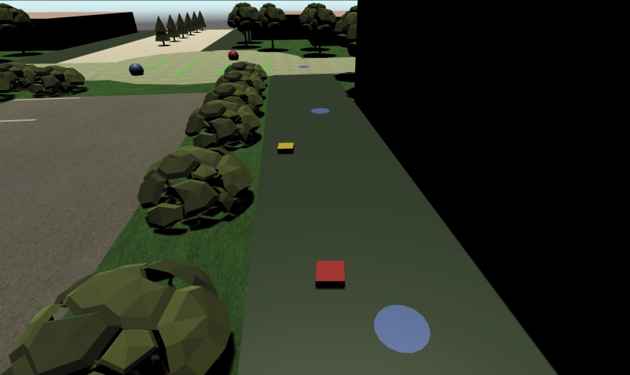
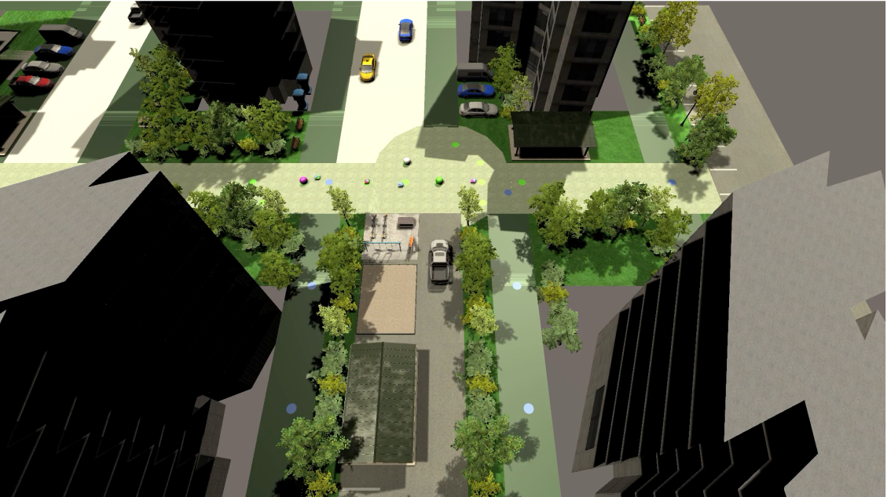

# How to Download Unity Environment.

# Index

- Demo Environment
- Environment from Google Drive
- Unity SDK

-------------------------------

## Demo Environment

>   git에서 기본적으로 제공되는 환경을 Demo 환경이라 합니다. 별도의 다운로드 없이 git안에 설치되어 있습니다.

>   

>   >   ./Env/*/DemovEnv01

>   

>   >   ./Env/*/LotteZoomIn

-------------------------------

## Environment from Google Drive

>   실물 환경의 경우, 용량문제로 git을 통해 다운로드할 수 없기 때문에 구글 드라이브를 통한 다운로드를 지원합니다.

>   

>   [Download Link][downloadEnvLink]

[downloadEnvLink]:https://drive.google.com/file/d/19URIScNmonaG8pDJv6_h3eeYtkHaMiLv/view?usp=sharing

> 다운로드 받은 후 ./Env/Linux 폴더 안에 복사해주시면 됩니다.

## Unity SDK

------------------------------

>   Prerequisites
>   >       unity 2019.4.6f1

>   > Following Version

>   >   >[Download Link][downloadFollowing]

>   >Demo Version

>   >   >[Download Link][downloadDemo]

>   >Real Version

>   >   >[Download Link][downloadReal]

[downloadFollowing]:https://drive.google.com/file/d/1-Pu9HQA9Lz8XYia6-sGAOL7HyB5nrzOm/view?usp=sharing
[downloadDemo]:https://drive.google.com/file/d/1-WZWSUy9RdkD8YHswuNyV9Wp6Eip6pL0/view?usp=sharing
[downloadReal]:https://drive.google.com/file/d/1ZQxzFQMEjPJGeNgwSbPF9vnmZvRBfE-I/view?usp=sharing