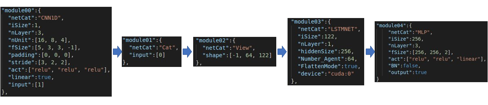

# How To Configure the Program

## Index
------------------------
+ How to build NetWork

+ Preprocess is dependent on Network

    + Example

+ Hyper-Parameter: Algorithms

---------------------------------

## How to build Network

>환경에 맞는 최적의 알고리즘을 구현하기 위해서는 최적의 네트워크 구조가 필요합니다. 최적의 네트워크 구조를 찾는 방법은 결국 실험을 통해 증명해 내는 일 밖에 없습니다. 

>그러므로, 높은 생산성을 위해 다양한 네트워크 구조를 코드 변경 없이 구현할 필요성이 대두됩니다.

>이를 위해서 본 프로젝트에서는 network정보를 .json 파일에 기입하고 이를 파징하는 방식을 선택했습니다.

>다음은 demo 환경에서 기본적으로 제공하는 network구조입니다.

>

>이를 이렇게 기입합니다.

>

>네트워크는 module로 이루워져있으며 각 module 뒤에는 index가 붙게됩니다. 각  index는 forward방향 순서대로 매겨지며, 각각의 module에서 network구조의 요소들이 정의됩니다. 

>이 프로젝트에서 지원되는 module은 다음 코드에서 확인할 수 있습니다.

    ./baseline/baseNetwork.py


## Preprocess is dependent on Network
-------------------------------------
>네트워크 구조가 정해지며, 이를 위해서 input을 정의해야합니다. 이때 환경의 observation으로부터 state까지 전처리 과정이 필요합니다.

>문제점은 __네트워크구조에__ 따라 state의 __전처리과정이__  __상이할__ 수 있다는 것이다.

>코드의 변경없이 네트워크 구조를 정의할 수 있지만, 전처리는 네트워크 구조에 의존하기 때문에 이를 해결하기 위해서, __decorator(wrapper)를__ 사용하였습니다.

>그러므로 네트워크 구조를 정의하면 그에 맞는 전처리 과정을 따로 정의해줘야합니다.

###  Example

>전처리는 크게 두가지 종류가 있습니다. 

>1. observation -> state 
>2. state -> batch 


>observation을 state로 처리하는 전처리와, memory로부터 받은 state를 batch로 변환하는 전처리가 있습니다.
-----------------------
> __첫__ __번째__, observation 전처리입니다.

> trainer의 method들 중 ppState는 @preprocessState의 데코레이터를 받습니다.

> ./PPO/wrapper.py에서 preprocessState를 정의하게 되면, ppState는 wrapper에 따라 가변적으로 구현됩니다.

```python
@preprocessState
def ppState(self, obs):
    return tuple([obs])

def preprocessState(f):
    def wrapper(self, obs):
        return your_obs_preprocess(self, obs)
    return wrapper
```

> 예시로 든 network에 observation은 전처리 한다고 가정해 보겠습니다.

```python

def your_obs_preprocess(self, obs) -> tuple:
    # obs:
    #   np.array
    #   [0:2]: relative pos
    #   [2:4]: relative velo
    #   [4:6]: y-axis angle/angle-velocity
    #   [6:8]: obs check/reward check
    #   [8:~]: lidar Point, lidar Point depends on Env configuration.

    rState = torch.tensor(obs[:, :6]).float().to(self.device)
    lidarPt = torch.tensor(obs[:, 8:self.sSize[-1]+8]).float().to(self.device)
    lidarPt = torch.unsqueeze(lidarPt, dim=1)
    state = (rState, lidarPt)
    return state

```
> 이때 전처리는 반드시 __tuple를__ 반환해야합니다.!! 

> 여러가지 입력을 지원하기 위해서 입력 데이터의 타입을 tuple로 고정했기 때문입니다.

------------------------

> __두__ __번쨰__ batch 전처리 입니다.

```python

@preprocessBatch
def train(self, state, action, gT, gAE, critic, step, epoch):
    ....


def preprocessBatch(f):
    def wrapper(self, step, epoch):
        your_batch_preprocess(self, step, epoch, f)
    return wrapper
```

>다음의 구조를 통해 구현됩니다. 여기서 batch preprocess는 단순히 메모리로부터  <s, a, r, s_, d>를 구하는 것 뿐만 아니라

> lstm cell state제어와, 훈련에 필요한 target value를 구하는 과정 역시 포함합니다.

```python
def your_batch_preprocess(self, step, epoch, f):
    f:self.train

    # LSTM의 BTTP를 위한 parameters
    k1 = self.data['K1']
    k2 = self.data['K2']
    div = int(k1/k2)

    rstate, lidarpt, action, reward, done = \
        [], [], [], [], []
    trstate, tlidarPt = [], []

    for data in self.replayMemory[0]:
        s, a, r, ns, d = data
        rstate.append(s[0])
        lidarPt.append(s[1])
        action.append(a)
        reward.append(r)
        done.append(d)
    for data in self.ReplayMemory_Trajectory:
        ts = data
        trstate.append(ts[0])
        tlidarPt.append(ts[1])
    rstate = torch.cat(rstate, dim=0)
    lidarPt = torch.cat(lidarPt, dim=0)
    nrstate, nlidarPt = ns
    nrstate, nlidarPt = torch.cat((rstate, nrstate), dim=0), torch.cat((lidarPt, nlidarPt), dim=0)
    lidarPt = lidarPt.view((-1, self.nAgent, 1, self.sSize[-1]))
    rstate = rstate.view((-1, self.nAgent, 6))
    nstate = (nrstate, nlidarPt)

    reward = np.array(reward)
    done = np.array(done)
    action = torch.tensor(action).to(self.device)
    
```
>리플레이 메모리로부터 sample들을 추출한 후, np.array에서 torch.tensor로 형변화를 합니다.

>이 후 LSTM Cell State를 제어하는 과정입니다.

>제어는 크게 두가지 요소에 적용됩니다.

>   > 첫번째는, 환경이 초기화되면 cell state역시 zero로 초기화 해야합니다.

>   >두번째, 전체 에피소드가 10개의 조각으로 나누어지게 되는데,<br/>
K번째 조각에서 훈련을 하기 위해서는 zero celld에서 K-1번째 조각까지의 sample에<br/> 해당하는 상태와 행동을 거친 cell state가 필요합니다.

>   >즉, 초기 cell state가 agent의 parameter에 의존하는 구조이기 때문에, 과거 trajectory memory를 <br/> 따로 정의하여, 매 조각마다 이를 이용하여 cell state를 구해야 합니다.

```python
    # 초기화
    self.agent.actor.zeroCellState()
    self.agent.critic.zeroCellState()
    self.copyAgent.actor.zeroCellState()
    self.copyAgent.critic.zeroCellState()

    # 과거 trajectory에 해당하는 sample을 forwarding
    # 이를 통해, 현재 agent의 파라미터에 맞는, init cell state를 구할 수 있다.
    self.agent.critic.forward(tState)
    self.copyAgent.critic.forward(tState)
    self.agent.actor.forward(tState)
    self.copyAgent.actor.forward(tState)

    # init cell state를 구했다.
    self.agent.actor.detachCellState()
    InitActorCellState = self.agent.actor.getCellState()
    InitCopyActorCellState = self.copyAgent.actor.getCellState()

    self.agent.critic.detachCellState()
    InitCriticCellState = self.agent.critic.getCellState()
    InitCopyCriticCellState = self.copyAgent.critic.getCellState()

    # 이를 기반으로 훈련을 시킨다.
    for _ in range(epoch):
        self.agent.actor.setCellState(InitActorCellState)
        self.agent.critic.setCellState(InitCriticCellState)

        # target value를 구하는 모습이다.
        value = self.agent.critic.forward(nstate)[0]  # . step, nAgent, 1 -> -1, 1
        value = value.view(k1+1, self.nAgent, 1)
        nvalue = value[1:]
        value = value[:-1]
        gT, gAE = self.getReturn(reward, value, nvalue, done)
        gT = gT.view(k1, self.nAgent)
        gAE = gAE.view(k1, self.nAgent)

        self.agent.critic.setCellState(InitCriticCellState)
        self.copyAgent.actor.setCellState(InitCopyActorCellState)
        self.copyAgent.critic.setCellState(InitCopyCriticCellState)
        self.zeroGrad()
        for i in range(div):
            _rstate = rstate[i*k2:(i+1)*k2].view(-1, 6)
            _lidarpt = lidarPt[i*k2:(1+i)*k2].view(-1, 1, self.sSize[-1])
            _state = (_rstate, _lidarpt)
            _action = action[i*k2:(i+1)*k2].view((-1, 2))
            _gT = gT[i*k2:(i+1)*k2].view(-1, 1)
            _gAE = gAE[i*k2:(i+1)*k2].view(-1, 1)
            _value = value[i*k2:(i+1)*k2].view(-1, 1)
            f(self, _state, _action, _gT, _gAE, _value, step, epoch)
            self.agent.actor.detachCellState()
            self.agent.critic.detachCellState()
        self.step(step+i, epoch)
        self.agent.actor.zeroCellState()
        self.agent.critic.zeroCellState()
        if zeroMode is False:
            self.agent.critic.forward(tState)
            self.agent.actor.forward(tState)
        InitActorCellState = self.agent.actor.getCellState()
        InitCriticCellState = self.agent.critic.getCellState()
```
> 이를 통해서 전처리 과정이 마무리 되고 훈련을 진행 할 수 있습니다.

# Hyper-Parameter: Algorithms

> cfg.json에서는 다양한 hyepr-parameter들을 정의 할 수 있습니다.<br/>
다음 목록은 이 프로젝트에서 제공하는 hyper-parameter 목록입니다.

* sSize: state shape, [list]
* aSize: action shape, [int]
* envName: path for env, [str],
* time_scale: for env, [float], default:1.0
* RecordScore: 이 점수를 넘으면 저장된다. [float], default:1e6
* no_graphics: render 여부, [bool], default:false

* env: ./cfg/LSTMTrain.json 참조

* LSTMNum: 몇 번째 모듈이 LSTM인지, [int], default:-1, -1이면 작동안함.

* agent: ./cfg/LSTMTrain.json참조

* gamma: discount_factor, [float], defulat:0.99,
* lambda: for PPO, [float], default:0.95,
* rScaling: reward scaling, [float], default:1.0
* entropyCoeff: entropy coefficient for PPO, [float], default:0.0
* epsilon: for PPO, [float], default:0.2
* updateStep: 업데이트 주기, [int], default:160
* div:deprecated, you must set 1.0
* epoch:epcoh for PPO, [int], defulat:1,
* updateOldP: old policy 업데이트 주기, [int], default:4
* initLogStd: entropy decaying for PPO, [float], default:-1.1
* finLogStd: entropy decaying for PPO, [float], default:-1.6
* annealingStep: step for Entropy decaying, [int], default:1e6

* sPath: path for save file, [str]
* writeTMode: tensorboard mode, [bool]
* tPath: path for tensorboard, [str]
* lpath: load path, [str]
* device: 어떤 장치에 tensor를 올릴지, [bool],default:"cpu"
* gpuOverload: deprecated
* inforMode: deprecated
* render: deprecated