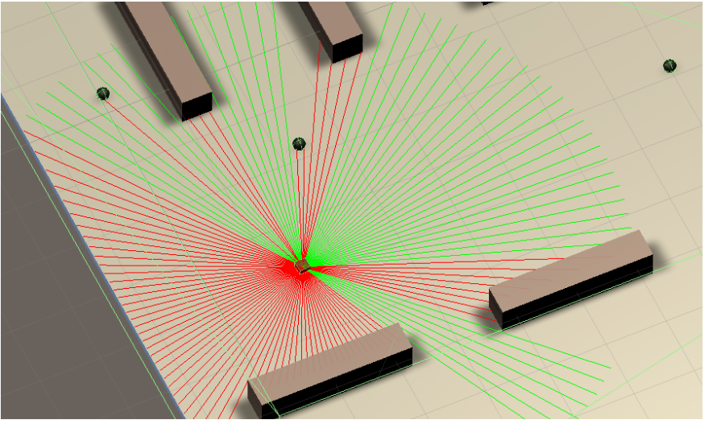
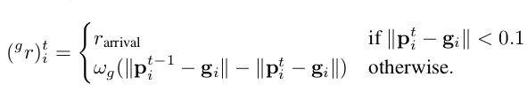
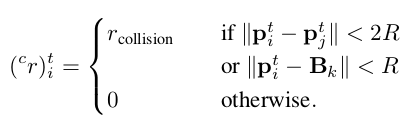
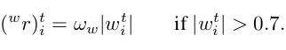

# How to manipulate the Environment

## Index

1. Parameters for Environment
2. How to move Camera

## Parameters for Environment

>* LSTMMode:1 or 0

>   >LSTMMode가 1이게 되면 활성화됩니다. 이 모드에서는 episode의 길이가 고정됩니다.  아무리 많이 부딪쳐도, episode는 끝나지 않다가 MaxStep에 이르면 초기화 됩니다.

>* ImgMode: deprecated

>* Resolution_LidarAngle:[float], defulat:3

>   >Lidar angle의 Resolution입니다. 0에 가까워질수록 촘촘해집니다.

>* LidarMeasurementDistance:[float]

>   >Lidar의 range

* Number_Agent:[int]

>   >distributed 환경(Lotte08_64)에서는 agent의 갯수는 정해지고 맨뒤에 오는 숫자(64)는 agent의 숫자입니다.  single환경에서는 1-8까지 에이전트의 수를 조정할 수 있습니다.

>* Number_MaxCollision:[int]

>   > test시 초기로 돌아가기까지 몇 번 충돌을 허용하는지 정합니다.

>* MaxStep:[int]

>   > 에피소드의 최대 길이

>* Velocity:[float]

>   > 에이전트의 종방향 최대 속도

>* YawRate:[float]

>   > 에이전트의 최대 각속도

>* Number_MaxArrivingReward:[int]

>   > 에이전트의 목표 타겟 수. 달성시 초기화

----------------------------------
Reward 관련 parameters

>* IntervalStep:[int]

>   >전 위치 업데이트 주기, 5이면 0.1s

>* RecommendedYawRate:[float]

>   >이 yawrate를 초과하면 penalty 부과

>* Penalty_OverAngularVelocity_AngularVelocity:[float]

>   >coefficient for yawRate penalty

>* Reward_ReachingDestination:[float]

>   > coefficient for Reaching Target.

>* Reward_ArrivingDestination:[float]

>   > reward for reaching Target.

>* Reward_ArrivingStartPoint:[float]

>   > reward for Start Point.

>* Penalty_Collision_Wall:[float]

>   > Penalty for collision with wall

>* Penalty_Collision_Agent:[float]

>   > Penalty for collision with Agent

>* Penalty_Collision_DynamicObs:[float]

>   > Penalty for collision with DynamicObs

## How to move Camera

>1~4번 버튼을 누르면 에이전트 관점에서 움직입니다.
 이때 z버튼을 누르면 앞뒤가 바뀝니다.

>전체모드 카메라일시 
 wasd로 상하좌우 움직입니다.
 그리고 q,e로 위아래 움직입니다.